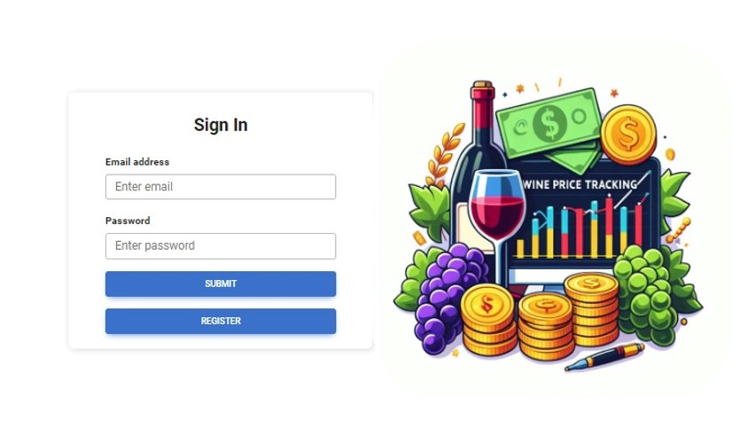
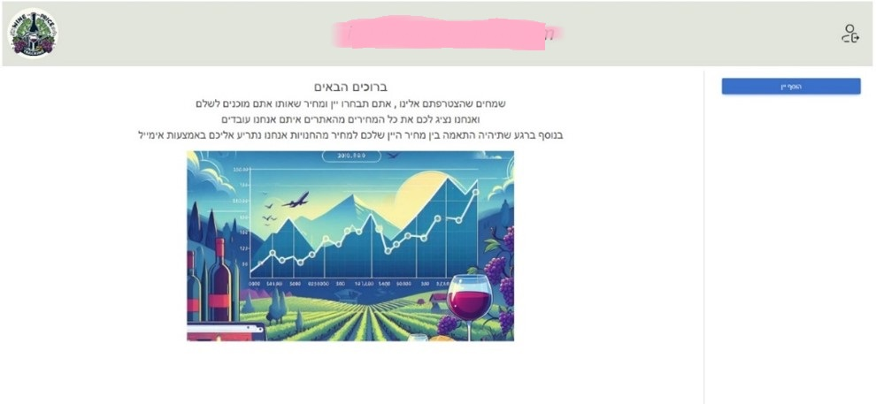
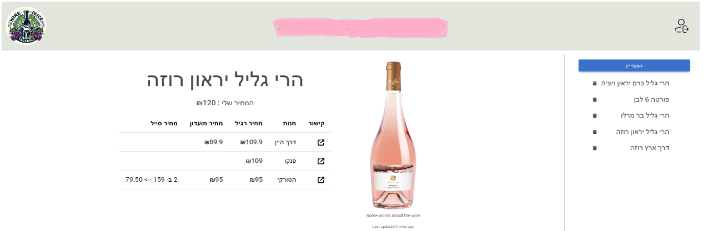

# Wine Price Tracker

## Overview

The Wine Price Tracker is a web application designed to help users track wine prices across multiple websites. Users can add wines to their list and set a desired price. If the wine's price matches or drops below the desired price, the application sends an email notification.

## Project Structure

### Backend
The backend is implemented using **Python** and **FastAPI**. It handles database management, wine price scraping, and user authentication.

```
backend
├── database
│   ├── init_database.py    # Script to initialize the database schema.
│
├── server
│   ├── crud_api.py         # Database CRUD operations for users, wines, and prices.
│   ├── helper.py           # Utility functions (e.g., password hashing).
│   ├── mail_sender.py      # Gmail API integration for sending alerts.
│   ├── product.py          # Product model for managing wine data.
│   ├── scraping_script.py  # Consolidates scraping across sites.
│   ├── server.py           # FastAPI app with endpoints for the frontend.
│
├── scraping
│   ├── controller.py       # Controls multi-site scraping tasks.
│   ├── haturky.py          # Scraping logic for Haturky.
│   ├── paneco.py           # Scraping logic for Paneco.
│   ├── similarity.py       # String similarity calculations for product matching.
│   ├── wine_rout.py        # Scraping logic for Wine Route.
```

### Frontend
The frontend is implemented using **React.js** and provides a clean user interface for interacting with the application.

```
front
├── public
│   ├── index.html          # Main HTML file for React app.
│   ├── wine_names.csv      # List of wine names for autocomplete.
│
├── src
│   ├── index.css           # Global CSS for the app.
│   ├── index.js            # Entry point for the React app.
│   ├── server.js           # Utility for interacting with the backend.
│
├── components
│   ├── add_Wine_Form.jsx   # Form to add a wine to the user’s list.
│   ├── App.css             # Styles for the app component.
│   ├── app.jsx             # Main application logic.
│   ├── home.jsx            # Home page displaying user’s wine list.
│   ├── login.jsx           # Login page component.
│   ├── product_details.jsx # Component to show wine details and prices.
│   ├── register.jsx        # Registration page component.
│   ├── user.jsx            # Context for managing user state.
│   ├── welcome.jsx         # Welcome page component.
│
├── assets
│   ├── link.png            # Link icon for external links.
│   ├── login.jpg           # Image for login page.
│   ├── logo.jpg            # Application logo.
│   ├── logout.png          # Logout button icon.
│   ├── welcome_img.png     # Welcome page image.
```

## Features

### Backend
- **User Authentication**: Secure registration and login using hashed passwords.
- **Database Management**: Stores user details, wines, and their prices using SQLite.
- **Web Scraping**: Scrapes wine prices from multiple sites (Haturky, Paneco, Wine Route).
- **Email Alerts**: Sends notifications to users when wine prices drop below their desired price.

### Frontend
- **User-Friendly UI**: React-based UI for managing wines and tracking prices.
- **Wine List Management**: Add wines to a personal list and set desired prices.
- **Dynamic Data**: Fetches the latest wine data from the backend.
- **Responsive Design**: Optimized for different screen sizes.

## Setup Instructions

### Prerequisites
- Node.js (for the frontend)
- Python 3.10+ (for the backend)
- SQLite (included with Python)
- Chrome WebDriver (for scraping)

### Backend Setup
1. Navigate to the `backend` directory:
   ```bash
   cd backend
   ```
2. Create a virtual environment and activate it:
   ```bash
   python -m venv venv
   source venv/bin/activate   # On Windows: venv\Scripts\activate
   ```
3. Install dependencies:
   ```bash
   pip install -r requirements.txt
   ```
4. Initialize the database:
   ```bash
   python database/init_database.py
   ```
5. Start the server:
   ```bash
   python server/server.py
   ```

### Frontend Setup
1. Navigate to the `front` directory:
   ```bash
   cd front
   ```
2. Install dependencies:
   ```bash
   npm install
   ```
3. Start the React development server:
   ```bash
   npm start
   ```

### Environment Configuration
- Backend server runs on: `http://localhost:8000`
- Frontend runs on: `http://localhost:3000`

### Gmail API Configuration (For Email Alerts)
1. Set up a Google Cloud project and enable the Gmail API.
2. Download the `client_secret.json` file and place it in the `backend/server` directory.
3. Run the backend to generate the `token.pickle` file for API access.

## Usage
1. **Register**: Create an account.
2. **Log In**: Access your account.
3. **Add Wines**: Search and add wines to your list, specifying desired prices.
4. **Track Prices**: The system automatically scrapes prices and sends alerts when matches occur.

## Future Improvements
- Add support for additional wine stores.
- Implement a recommendation system for wines.
- Integrate payment gateway for purchases.

## Images





## Contributors
- **Eran Helvitz**: Project Lead
